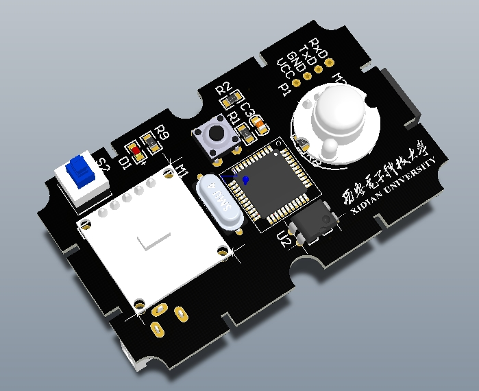
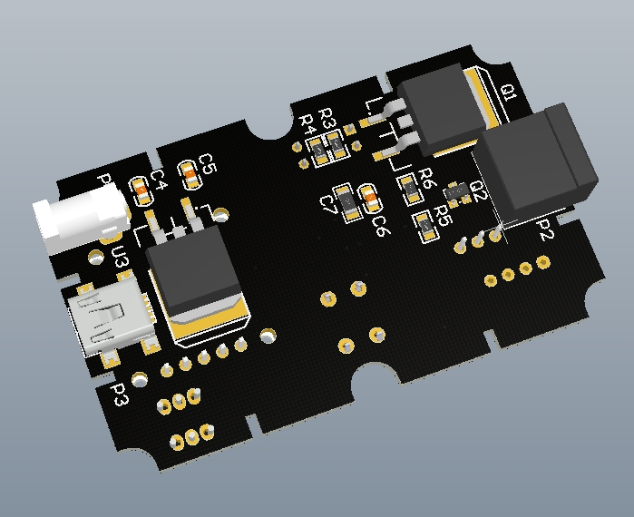
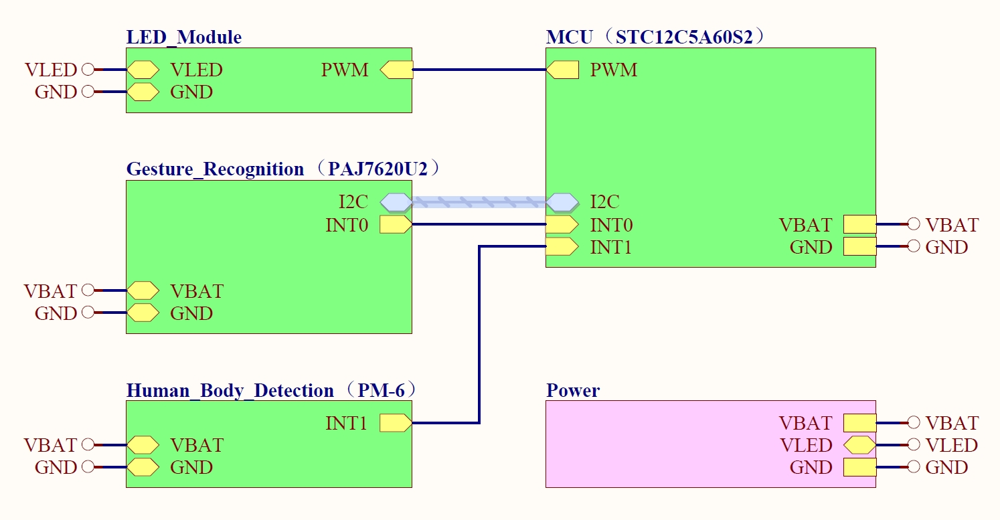
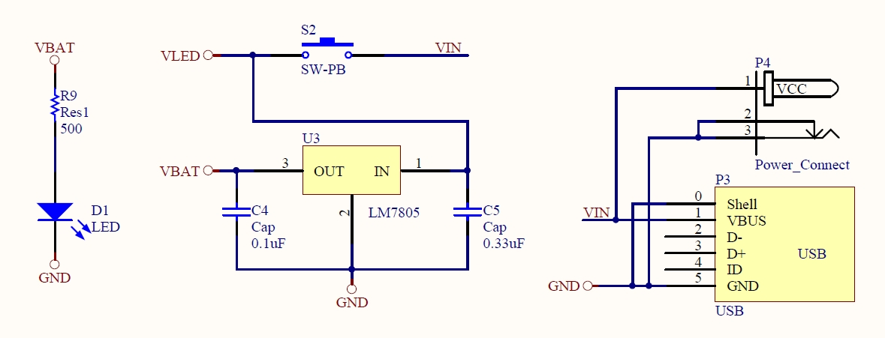
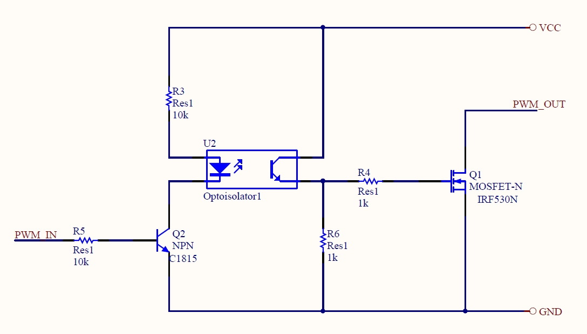
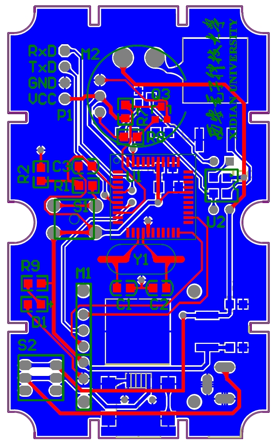
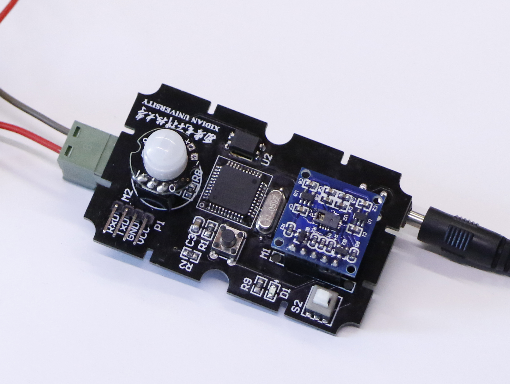

# 手势调光灯

本Repo归档作者大四闲暇时做的中断驱动手势调光灯。该调光灯的主要功能是：采用扫掠的手势进行开关灯；若手悬停在传感器上方，则灯具会根据手与传感器之间的距离调节亮度。

## 软件
该手势调光灯由中断驱动：每次检测到手势，手势传感器会发起中断请求，MCU接收中断请求并设置全局变量。主循环根据全局变量状态调用各功能函数。

## 电路图与器件选型

上图展示了项目的总体硬件电路图，涉及MCU，手势传感器，人体传感器，以及灯光控制电路和电源电路。

本项目选用STC89C52RC作为主控芯片（其内部集成了PWM模块，便于亮度控制）；选用GrooveGesture的PAJ7620U2作为手势传感器，该传感器可同时测量手势以及手与传感器的距离；另外选用PM-6热释电传感器作为人体传感器（直到目前，人体传感器未被项目启用）。

上图为电源电路构成：支持USB供电或外部9V/12V电源供电（通过LM7805降至5V）

上图为调光电路：采用场效应管放大PWM方波供LED灯使用，并采用光电耦合器隔离功率部件。

## PCB

Altium Designer绘制的PCB

## 实物图

